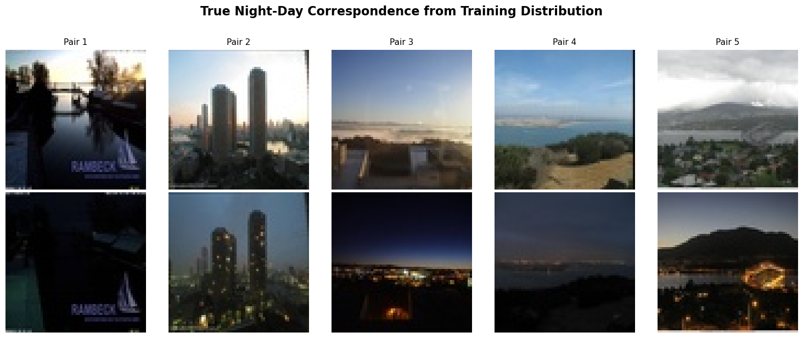
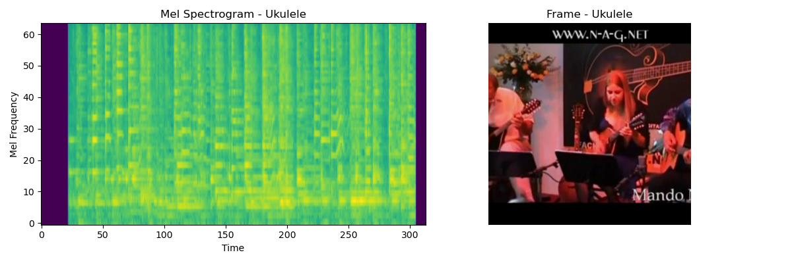

# Multimodal Density-Ratio Guided Diffusion

<p align="center">
  
  
  
  
</p>

> **Status:** 🚧 Ongoing research project — active development  
> **Metrics:** Quantitative evaluation (FID/KID, CLIP/AudioCLIP/ImageBind similarity, alignment metrics) **coming soon**

## 📋 Overview

This repository explores **guidance for frozen diffusion models** using a **learned log‑density ratio** signal (the pointwise mutual information, PMI). We train a **density-ratio estimator** at multiple noise levels $t$ to approximate the **log‑density ratio / PMI** term:

$$\log \frac{p(x_t,y_t)}{p(x_t)\,p(y_t)}$$

At sampling time, we add its gradient to the base score so the sampler prefers **corresponding pairs**.

### 🎯 Key Features

- **No finetuning of base diffusion models** (we train a small density‑ratio head; base DDPM/SD/AudioLDM remain frozen)
- **Multiple density-ratio objectives** (Discriminator, DV, uLSIF, RuLSIF, KLIEP)
- **Two modality settings**:
  - Night → Day image translation (DDPM)
  - Audio → Image generation (AudioLDM2 + Stable Diffusion)
- **Latent space guidance** for pretrained models

## 🖼️ Supported Modalities

### Night → Day Image Translation
<p align="center">
  
  <br>
  <em>Examples of night-to-day image pairs used for training the density ratio estimator</em>
</p>

Two separately trained DDPMs (night/day) with a ratio model that learns correspondence across noise levels. The gradient nudges the "day" sampler toward the night input.

### Audio → Image Generation
<p align="center">
  
  <br>
  <em>Audio-Visual Event (AVE) dataset samples showing paired audio spectrograms and corresponding images</em>
</p>

Guidance in **latent space** using pretrained VAEs (AudioLDM2, SD). The ratio model is trained on **AVE video clips preprocessed into mel‑spectrograms and aligned image frames**; its gradient steers Stable Diffusion toward the audio input.

## 🔬 Technical Approach

### Density Ratio Learning

Let $q(x_t,y_t)=p(x_t,y_t)$ (joint) and $r(x_t,y_t)=p(x_t)p(y_t)$ (product of marginals), both at the **same** noise level $t$. We **do not estimate global mutual information** $I(X;Y)$; we directly estimate the **pointwise** log‑ratio $\log\frac{q}{r}$ (PMI).

We learn a time-conditioned estimator $\hat{\ell}_\theta(x_t,y_t,t)$ such that:

$$\hat{\ell}_\theta \approx \log\frac{q}{r}$$

### Guided Sampling

During sampling for $x_t\mid y_t$, the guidance is:

$\nabla_{x_t}\log p(x_t\mid y_t) \approx \underbrace{s_\phi(x_t,t)}_{\text{unconditional score}} + \lambda\,\nabla_{x_t}\hat{\ell}_\theta(x_t,y_t,t)$

with an optional schedule $\lambda=\lambda(t)$ (e.g., scaled by $\sigma_t$).

## 📦 Installation

### Prerequisites

- Python 3.9+
- CUDA 11.7+ (for GPU support)
- 16GB+ GPU memory recommended

### Environment Setup

```bash
# Create conda environment
conda create -n mm_guidance python=3.9 -y
conda activate mm_guidance

# Install PyTorch (adjust CUDA version as needed)
pip install torch torchvision torchaudio --index-url https://download.pytorch.org/whl/cu121

# Install dependencies
pip install einops tqdm soundfile librosa scikit-learn
pip install diffusers transformers accelerate safetensors
```

## 🚀 Quick Start

### Training

Train density-ratio (PMI) models for different modality pairs:

```bash
# Night↔Day with discriminator loss
python src/train.py ddpm_night2day --loss_type disc --epochs 20

# Audio→Image with RuLSIF (latent space)
python src/train.py sd_audioldm --loss_type rulsif --batch_size 16
```

### Inference

Generate guided samples:

```bash
# Guided night→day pairs (DDPM)
python src/inference.py ddpm_night2day \
    --loss_type disc \
    --guidance_scale 2.0 \
    --sampling_steps 100

# Audio-conditioned images (SD + AudioLDM2)
python src/inference.py sd_audioldm \
    --loss_type rulsif \
    --guidance_scale 1.5
```

## 📊 Implemented Density-Ratio Objectives

We parameterize a small network $T_\theta(x_t,y_t,t)$ and map it to a ratio or log-ratio:

| Method | Objective | Guidance Signal |
|--------|-----------|-----------------|
| **Discriminator** | Logistic classification: $\mathbb{E}_q[-\log\sigma(T)] + \mathbb{E}_r[-\log(1-\sigma(T))]$ | $\nabla_{x_t} T_\theta$ (Bayes‑optimal logit ≈ log(q/r)) |
| **Donsker–Varadhan** | MI-style DV objective: maximize $\mathbb{E}_q[T] - \log \mathbb{E}_r[e^{T}]$; at optimum $T≈\log(q/r)+const$ | $\nabla_{x_t} T_\theta$ |
| **uLSIF** | Direct ratio fitting: $\tfrac{1}{2} \mathbb{E}_r[w^2] - \mathbb{E}_q[w]$ | $\nabla_{x_t} \log w$ |
| **RuLSIF** | Relative ratio: $w_\alpha = \frac{q}{\alpha q + (1-\alpha) r}$ | $\nabla_{x_t} \log\left(\frac{w_\alpha}{1-\alpha w_\alpha}\right)$ |
| **KLIEP** | KL-based: $\max_\theta\; \mathbb{E}_q[\log w] \;\text{s.t.}\; \mathbb{E}_r[w]=1$ | $\nabla_{x_t} \log w$ |

## 📁 Project Structure

```
data/                                # Dataset storage
├── ave/                            # Audio-Visual Event dataset
├── night2day/                      # Night/Day image pairs
└── processed/                      # Preprocessed data

src/
├── dataloaders/
│   ├── ave.py                      # AVE (audio–image) pairs
│   └── night2day.py                # Night/Day image pairs
├── models/
│   └── mi_models.py                # Ratio/PMI estimators
├── utils/
│   ├── density_ratio_losses.py     # Loss implementations
│   ├── diffusion_schedule.py       # Schedules & time embeddings
│   ├── score_computation.py        # Gradient computation
│   ├── guided_sampler_native.py    # Native DDPM guidance
│   └── diffusion_model_loader.py   # Model loaders
├── ddpm/
│   └── denoising_diffusion_pytorch/  # Local DDPM implementation
├── train.py                         # Training script
└── inference.py                     # Inference script

checkpoints/                         # Saved models
├── {loss_type}/
│   └── {model_type}_{loss_type}_mi_model_best.pt

figures/                             # Dataset visualizations
├── night2day_dataset.png
└── ave_dataset.png
```

## 💾 Model Checkpoints

- **DDPM models:** `src/ddpm/results/<domain>/<cfg>/<run_timestamp>/model-<k>.pt`
- **Ratio (PMI) models:** `checkpoints/{loss_type}/{model_type}_{loss_type}_mi_model_best.pt`

## 📈 Datasets

### Night/Day Dataset
- Paired night and day images for image-to-image translation
- Curated correspondences between different lighting conditions

### AVE (Audio-Visual Event) Dataset
- **Video** dataset of 4,143 ten‑second clips across **28** event classes ([CVF Open Access](https://openaccess.thecvf.com/content_ECCV_2018/papers/Yapeng_Tian_Audio-Visual_Event_Localization_ECCV_2018_paper.pdf))
- We **preprocess** each clip into a mel‑spectrogram and one or more aligned **video frames** for training the ratio model
- Negatives for product‑of‑marginals are generated via in‑batch shuffling

## 🗺️ Roadmap

- [ ] **Quantitative Metrics**
  - [ ] FID/KID scores
  - [ ] CLIP/AudioCLIP/ImageBind similarity
  - [ ] Cross-modal alignment metrics
- [ ] **Ablation Studies**
  - [ ] Loss function comparison
  - [ ] Guidance scale analysis
  - [ ] Schedule ablations
- [ ] **Extended Modalities**
  - [ ] Text → Image guidance
  - [ ] Video → Audio generation
  - [ ] Cross-domain translation
- [ ] **Model Improvements**
  - [ ] Adaptive guidance scheduling
  - [ ] Multi-scale density ratios
  - [ ] Efficiency optimizations

## 📝 Citation

If you use this code or find our work helpful, please cite:

```bibtex
@inprogress{mm_guidance_2025,
  title   = {Mutual-Information Guided Sampling for Multimodal Diffusion},
  author  = {Oubari, Fouad and Collaborators},
  year    = {2025},
  note    = {Work in progress}
}
```

## 🤝 Contributing

We welcome contributions! Please feel free to submit issues or pull requests.

## 📄 License

This project is licensed under the MIT License - see the [LICENSE](LICENSE) file for details.

## 🙏 Acknowledgments

- AVE dataset creators
- Authors of diffusers, AudioLDM2, and Stable Diffusion
- Density ratio estimation literature

---

<p align="center">
  <em>For questions or collaborations, please open an issue or contact the authors.</em>
</p>
